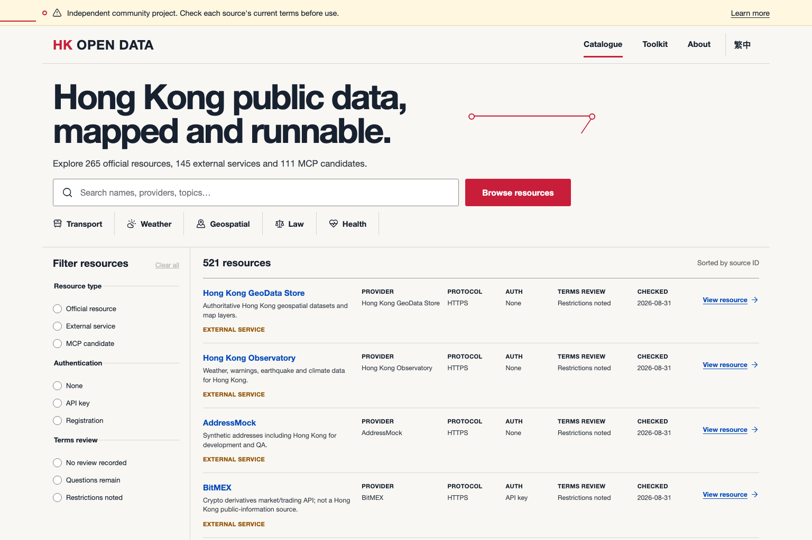

# HK Open Data

[](LICENSE)
[](https://github.com/angusf777/hk-open-data/stargazers)
[](catalog/generated/counts.json)
[](https://github.com/angusf777/hk-open-data/actions/workflows/ci.yml)

> **Independent community project.** This repository is not operated by, affiliated with, or
> endorsed by the Hong Kong Government or any listed provider. It is a catalogue and optional
> self-hosted toolkit—not a hosted data service. Upstream sources and their current terms always
> control.

## Hong Kong public data, mapped and runnable.

Find official APIs, useful external data sources, and MCP projects in one searchable, bilingual
catalogue. Every record keeps its provenance, verification date, and terms-evidence state visible.

<!-- catalog-counts:start -->
**521 resources** · **265 official** · **145 external** · **111 MCP candidates**
<!-- catalog-counts:end -->

[**Browse the live catalogue →**](https://angusf777.github.io/hk-open-data/) ·
[Run it locally](#run-the-catalogue-locally) · [繁體中文版](README.zh-HK.md)



## Why this project exists

Hong Kong public-data discovery is fragmented across portals, departmental pages, third-party
services, and community tools. HK Open Data turns that landscape into reviewable public metadata:

- **Discover:** search one bilingual index instead of maintaining private bookmark lists.
- **Evaluate:** see provider, access method, protocol, last check, and rights-evidence state before
  opening an upstream source.
- **Build:** generate deterministic JSON for local applications and optionally run the fail-closed,
  self-hosted P01/P14 toolkit.
- **Improve:** correct one YAML record through a small, source-backed pull request.

The static site reads only repository-generated JSON. It does not call providers, copy their
datasets, create accounts, or track visitors. External navigation happens only when a user chooses
an upstream link.

## Run the catalogue locally

Requirements: Git, Node.js 22+, pnpm 10+, Python 3.12+, and
[uv](https://docs.astral.sh/uv/). Docker is **not** required for the catalogue.

```bash
git clone https://github.com/angusf777/hk-open-data.git
cd hk-open-data
pnpm install --frozen-lockfile && uv sync --frozen --all-groups
make catalogue
```

Open `apps/catalog/dist/index.html` through a static HTTP server, or use
`pnpm --filter @hk-open-data/catalog dev` during development. See the
[catalogue guide](docs/getting-started/catalogue.md) for editing and verification.

## What is in the catalogue?

| Collection | Meaning | Inclusion does not mean |
| --- | --- | --- |
| Official | Resources attributed to Hong Kong public authorities | Government endorsement, guaranteed uptime, or permission for a proposed use |
| External | Third-party, academic, nonprofit, or community resources relevant to Hong Kong | Project endorsement, security review, or licence clearance |
| MCP | Community MCP servers and related projects to evaluate | Installation, execution, safety, compatibility, or provider authorization |

The YAML records in [`catalog/`](catalog/) are authoritative for this repository. Generated JSON,
including a compact search index, lives in [`catalog/generated/`](catalog/generated/). The
[field reference](docs/resources/CATALOGUE_FIELDS.md) explains every value.

## Evidence labels are not legal conclusions

`termsEvidence` reports what was found at a source on a recorded date. It does **not** decide whether
commercial use, caching, redistribution, scraping, attribution, personal-data processing, or any
other activity is lawful or permitted. A missing restriction is not permission. A reachable URL is
not production approval. Records may be incomplete, outdated, or wrong.

Before using a resource, review the provider's current dataset-specific and platform-wide terms,
policies, licences, technical controls, and applicable law. Obtain provider confirmation or
professional advice where appropriate. Read [Source Rights and Evidence](docs/governance/SOURCE_RIGHTS.md).

## Optional self-hosted toolkit

The repository includes two optional local, fail-closed runtime components without turning this
project into a hosted resale service:

- **P01 — Public Data Fabric:** local normalized read access, SDK surfaces, and read-only MCP tools.
- **P14 — API Quality Observatory:** local probes and quality evidence for explicitly enabled
  sources.

Plain `docker compose up` starts only the `catalogue` profile and performs no provider traffic.
`observe` is an explicit, digest-only runtime; `fabric` adds raw-evidence retention for sources the
operator has separately approved. All seeded sources and connectors remain inactive. Setup,
verification, local endpoints, and activation boundaries are documented in the bilingual
[runtime guide](docs/getting-started/runtime.md).

## Architecture

```text
source-backed YAML ── validate ── deterministic JSON ── static bilingual catalogue
       │                         │
       └── provenance/evidence  └── optional local P01/P14 runtime (explicit profiles)
```

See [Architecture Overview](docs/architecture/OVERVIEW.md) and
[Open-source Design](docs/architecture/OPEN_SOURCE_DESIGN.md) for trust boundaries and data flow.

## Contribute

Good first contributions include correcting a URL, adding a missing official resource, reviewing a
Traditional Chinese translation, or improving accessibility. Start with [CONTRIBUTING.md](CONTRIBUTING.md)
and use the issue templates. Please submit factual metadata and authoritative source links—never
credentials, personal data, private correspondence, or copied provider datasets.

For inaccurate metadata, attribution, rights, privacy, or provider representation, use the
[correction and takedown process](docs/governance/CORRECTIONS_AND_TAKEDOWNS.md). Report
vulnerabilities privately under [SECURITY.md](SECURITY.md).

## Roadmap

See [ROADMAP.md](ROADMAP.md) for the `Now / Next / Later` plan and the explicit boundary against a
centrally hosted data service without a new rights and architecture review.

## Licence and upstream material

Project-authored code and documentation are licensed under [Apache License 2.0](LICENSE). Catalogue
facts, names, links, upstream APIs, datasets, documentation, trademarks, and provider content remain
subject to their respective rights and terms. The repository licence does not grant rights in
upstream material. See [NOTICE](NOTICE) for the full project notice.
