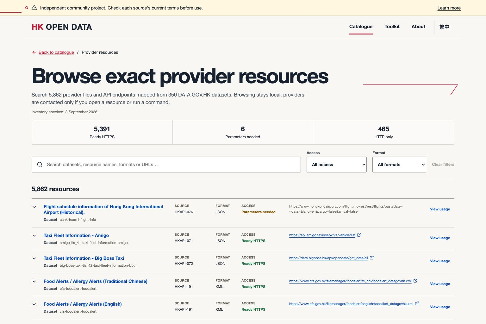

# HK Open Data

[](LICENSE)
[](https://github.com/angusf777/hk-open-data/stargazers)
[](https://github.com/angusf777/hk-open-data/releases)
[](https://github.com/angusf777/hk-open-data/graphs/contributors)
[](catalog/generated/counts.json)
[](https://github.com/angusf777/hk-open-data/actions/workflows/ci.yml)

> **Independent community project.** This repository is not operated by, affiliated with, or
> endorsed by the Hong Kong Government or any listed provider. It is a catalogue and optional
> self-hosted toolkit—not a hosted data service. Original sources and their current terms always
> control.

## Hong Kong public data, mapped and runnable.

Find official APIs, useful external data sources, and MCP projects in one searchable, bilingual
catalogue. Every record shows where the information came from, when it was checked, and what we
found about the source's terms of use.

<!-- catalog-counts:start -->
**521 sources** · **265 official** · **145 external** · **111 MCP candidates**
<!-- catalog-counts:end -->

[**Browse the live catalogue →**](https://angusf777.github.io/hk-open-data/) ·
[Browse provider files and APIs](https://angusf777.github.io/hk-open-data/provider-resources/) ·
[Run it locally](#run-the-catalogue-locally) · [繁體中文版](README.zh-HK.md)



## Why this project exists

Hong Kong public-data discovery is fragmented across portals, departmental pages, third-party
services, and community tools. HK Open Data turns that landscape into reviewable public metadata:

- **Discover:** search one bilingual index instead of maintaining private bookmark lists.
- **Evaluate:** see the provider, access method, protocol, last check, and terms review before
  opening a source.
- **Build:** start from tested quickstarts, copy bounded commands, download metadata as JSON, CSV or
  SQLite, or run the optional developer toolkit on your own computer.
- **Improve:** correct one YAML record through a small, source-backed pull request.

The static site reads only repository-generated JSON. It does not call providers, copy their
datasets, create accounts, or track visitors. External navigation happens only when a user chooses
a source link.

## Run the catalogue locally

Requirements: Git, Node.js 22+, pnpm 10+, Python 3.12+, and
[uv](https://docs.astral.sh/uv/). Docker is **not** required for the catalogue.

```bash
git clone https://github.com/angusf777/hk-open-data.git
cd hk-open-data
pnpm install --frozen-lockfile && uv sync --frozen --all-packages --all-groups
make catalogue
```

Open `apps/catalog/dist/index.html` through a static HTTP server, or use
`pnpm --filter @hk-open-data/catalog dev` during development. See the
[catalogue guide](docs/getting-started/catalogue.md) for editing and verification.

## What is in the catalogue?

| Collection | Meaning | Inclusion does not mean |
| --- | --- | --- |
| Official | Resources attributed to Hong Kong public authorities | Government endorsement, guaranteed uptime, or permission for a proposed use |
| External | Third-party, academic, nonprofit, or community resources relevant to Hong Kong | Project endorsement, security review, or licence clearance |
| MCP | Community MCP servers and related projects to evaluate | Installation, execution, safety, compatibility, or provider authorization |

The YAML records in [`catalog/`](catalog/) are authoritative for this repository. Generated JSON,
including a compact search index, lives in [`catalog/generated/`](catalog/generated/). The
[field reference](docs/resources/CATALOGUE_FIELDS.md) explains every value.

## Check each source before you use it

The catalogue's terms-review label summarizes what the project found on a recorded date. It does
**not** decide whether commercial use, caching, redistribution, scraping, attribution,
personal-data processing, or any other activity is lawful or permitted. A missing restriction is
not permission, and a working link does not mean a source is approved for your intended use.
Records may be incomplete, outdated, or wrong.

Before using a resource, review the provider's current dataset-specific and platform-wide terms,
policies, licences, technical controls, and applicable law. Obtain provider confirmation or
professional advice where appropriate. Read [Source terms and permissions](docs/governance/SOURCE_RIGHTS.md).

## Optional developer toolkit

The repository now includes a practical access recipe for all **265 official sources**. Each recipe
turns source documentation into a versioned request contract or explains the exact manual step
still needed:

- **227 executable recipes** have bounded parameters, curl/Python/TypeScript examples, and hashed
  synthetic fixtures.
- **190 DATA.GOV.HK resource-index recipes** contain 356 reviewed source-to-dataset mappings across
  350 unique dataset identifiers. A 4 September 2026 refresh resolved these to **5,862 actual
  provider resources**: 5,391 parameter-free HTTPS URLs, 6 parameterized URL templates, and 465
  HTTP-only legacy URLs that the safe fetcher refuses.
- A bounded payload run on 4 September 2026 received a non-empty 2xx sample from a direct file or
  API for **234 of the 350 datasets**. It recorded 5 current provider failures and 111 datasets
  whose listed resources were parameterized, HTTP-only, landing pages, geoportals, or otherwise
  lacked a parameter-free direct HTTPS payload candidate.
  This is representative dataset proof—not a claim that all 5,862 URLs were downloaded. Every
  exception is published in the [provider-resource verification report](docs/access/provider-resources.md).
- **37 direct-response recipes** contact a documented data endpoint. A fresh 3 September 2026 run
  succeeded for twenty-nine; eight retain fixture evidence and a recorded live failure.
- **38 manual guides** identify a concrete documentation, account, interactive-workflow, or
  unresolved endpoint boundary. In total, 219 recipes currently have matching live evidence;
  evidence expires and does not promise later availability.

Use the bilingual [provider-resource browser](https://angusf777.github.io/hk-open-data/provider-resources/)
to search the complete current inventory, filter by URL type and payload evidence, open a permanent
dataset page, and generate bounded cURL, Python, Node or `hkdata` commands for the exact direct
resources that passed. Search and filters have shareable URLs. Browsing and generating commands
remain local; a provider is contacted only when you open its resource link or run a command.

Start with one of five current, evidence-backed guides: [transport routes](docs/quickstarts/transport-routes.md),
[weather forecast](docs/quickstarts/weather-forecast.md), [air quality](docs/quickstarts/air-quality.md),
[traffic geospatial data](docs/quickstarts/traffic-geospatial.md), or
[company information](docs/quickstarts/company-information.md).

Machines can use the [catalogue JSON](catalog/generated/catalogue.json), exact
[provider-resource inventory](access/generated/data-gov-resources.json), or the live site's
[JSON, CSV and SQLite metadata snapshots](https://angusf777.github.io/hk-open-data/downloads/README.txt)
with a [copyable download and query guide](docs/getting-started/metadata-downloads.md).
Those downloads contain project metadata and technical evidence, not provider dataset payloads.

The **145 external resources** and **111 community MCP projects** are discovery entries, not bundled
connectors. A 1 September 2026 link check reached or followed a valid redirect for 128 external
entries and 107 MCP repositories; it recorded findings for the rest. Those checks did not log in to
external APIs or install and execute third-party MCP code. The repository's own 15-tool read-only
MCP server is separately covered by contract and integration tests. See the
[coverage and evidence matrix](docs/access/coverage.md).

Inspect a recipe and generate working code without making a network request:

```bash
uv run --project packages/sdk-python hkdata recipe HKAPI-001
uv run --project packages/sdk-python hkdata example HKAPI-001 python
uv run --project packages/sdk-python hkdata resources HKAPI-030
uv run --project packages/sdk-python hkdata resource-example HKAPI-030 \
  96c5e827-3d3a-4110-8cd2-e7c80cd562bc curl \
  --dataset nlb-bus-nlb-bus-service-v2
```

In installed form these are `hkdata recipe HKAPI-001` and
`hkdata example HKAPI-001 python`. Contact a listed source only through an explicit command after
reviewing its current terms:

```bash
uv run --project packages/sdk-python hkdata verify HKAPI-001
uv run --project packages/sdk-python hkdata fetch HKAPI-001 --output json
uv run --project packages/sdk-python hkdata fetch-resource HKAPI-030 \
  96c5e827-3d3a-4110-8cd2-e7c80cd562bc \
  --dataset nlb-bus-nlb-bus-service-v2 --max-bytes 1048576 \
  --output nlb-routes.json
```

The local REST API, Python and TypeScript SDKs, and four read-only access MCP tools expose both the
recipe registry and exact provider-resource inventory. `access_resources_list` and
`access_resource_get` return URL templates, required parameters, access classifications and CLI
usage without contacting providers; explicit downloads remain a CLI action.

Running `docker compose up` starts the catalogue only and does not contact external data providers.
Data connections must be enabled individually after you review each source's applicable terms and
permissions. Start with the bilingual [source-access guide](docs/getting-started/access-recipes.md)
for copyable commands, then use the [self-hosting guide](docs/getting-started/runtime.md) if you need
the local API, SDK or MCP services.

Technical guidance does not grant permission for commercial use, caching, redistribution,
scraping, or any other proposed use. Source-specific terms and applicable law remain controlling.

## Architecture

```text
source-backed YAML ── validate ── deterministic JSON ── static bilingual catalogue
       │                         │
       └── sources and reviews  └── optional local data and health tools
```

See [Architecture Overview](docs/architecture/OVERVIEW.md) and
[Open-source Design](docs/architecture/OPEN_SOURCE_DESIGN.md) for trust boundaries and data flow.

## Contribute

Good first contributions include correcting a URL, adding a missing official source, improving one
quickstart, or adding an accessibility regression test. Start with the
[scoped first-contribution list](docs/community/GOOD_FIRST_ISSUES.md), [CONTRIBUTING.md](CONTRIBUTING.md),
and the issue templates. Questions are welcome in [Discussions](https://github.com/angusf777/hk-open-data/discussions);
support boundaries are in [SUPPORT.md](SUPPORT.md).

If you reference the project in research or software, use [CITATION.cff](CITATION.cff) and cite the
original data provider separately. Please submit factual metadata and authoritative source links—never
credentials, personal data, private correspondence, or copied provider datasets.

For inaccurate metadata, attribution, rights, privacy, or provider representation, use the
[correction and takedown process](docs/governance/CORRECTIONS_AND_TAKEDOWNS.md). Report
vulnerabilities privately under [SECURITY.md](SECURITY.md).

## Roadmap

See [ROADMAP.md](ROADMAP.md) for the `Now / Next / Later` plan and the explicit boundary against a
centrally hosted data service without a new rights and architecture review.

## Licence and third-party material

Project-authored code and documentation are licensed under [Apache License 2.0](LICENSE). Catalogue
facts, names, links, third-party APIs, datasets, documentation, trademarks, and provider content
remain subject to their respective rights and terms. The repository licence does not grant rights
in third-party material. See [NOTICE](NOTICE) for the full project notice.
