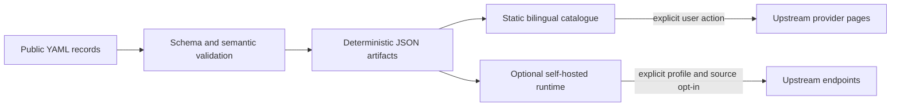

# Architecture overview

HK Open Data is catalogue-first. The default product is a static website built from versioned,
source-backed YAML. Optional runtime services consume the same generated catalogue but cannot make
provider requests in the default profile.

## Catalogue path

1. Maintainers edit one resource file under `catalog/` and cite an evidence URL.
2. JSON Schema and semantic checks reject malformed IDs, missing bilingual fields, insecure URLs,
   invalid evidence states, and duplicate records.
3. The generator sorts records and keys deterministically, then writes aggregate, collection,
   search, stale-review, and count artifacts.
4. The React application builds those local artifacts into static routes, including a permalink for
   every resource.
5. GitHub Pages serves static files. Search, filtering, locale changes, and detail navigation do not
   call provider systems.

## Optional runtime path

The P01/P14 runtime is isolated behind explicit Docker Compose profiles and operator-controlled
flags. `catalogue` serves local artifacts only. `observe` may store digests and measurement metadata
for individually enabled sources. `fabric` may add raw-evidence storage only when the source has a
compatible, recorded approval and the operator enables it deliberately.

## Trust boundaries

| Boundary | Repository guarantee | Outside the guarantee |
| --- | --- | --- |
| Catalogue record | Schema-valid, reproducibly generated metadata for the tested commit | Upstream correctness, completeness, uptime, security, or permission |
| Static site | Local catalogue reads and explicit external navigation | Behaviour of upstream pages after navigation |
| Runtime defaults | No provider access in the default profile | Operator configuration, deployment security, and upstream authorization |
| Evidence state | Dated description of project research | Legal advice, rights clearance, endorsement, or production qualification |

See [Open-source Design](OPEN_SOURCE_DESIGN.md) for product boundaries and
[Source Rights and Evidence](../governance/SOURCE_RIGHTS.md) for the legal-evidence model.
