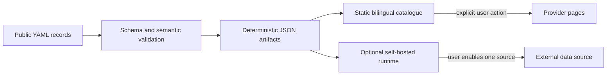

# Architecture overview

HK Open Data is catalogue-first. The default product is a static website built from versioned,
source-backed YAML. Optional runtime services consume the same generated catalogue but cannot make
provider requests in the default profile.

## Catalogue path

1. Maintainers edit one resource file under `catalog/` and cite an evidence URL.
2. JSON Schema and semantic checks reject malformed IDs, missing bilingual fields, insecure URLs,
   invalid review states, and duplicate records.
3. The generator sorts records and keys deterministically, then writes aggregate, collection,
   search, stale-review, and count artifacts.
4. The React application builds those local artifacts into static routes, including a permalink for
   every resource.
5. GitHub Pages serves static files. Search, filtering, locale changes, and detail navigation do not
   call provider systems.

## Optional toolkit path

The self-hosted toolkit keeps every external data connection off by default. `catalogue` serves
local files only. The `observe` mode can check individually enabled sources while storing a SHA-256
fingerprint and summary measurements instead of response content. The `fabric` mode can store full
source responses only when the user enables that storage for a source after reviewing its terms.

## Trust boundaries

| Boundary | Repository guarantee | Outside the guarantee |
| --- | --- | --- |
| Catalogue record | Schema-valid, reproducibly generated metadata for the tested commit | Provider correctness, completeness, uptime, security, or permission |
| Static site | Local catalogue reads and explicit external navigation | Behaviour of provider pages after navigation |
| Toolkit defaults | No external data access in the default mode | User configuration, deployment security, and permission to use each source |
| Terms review | Dated summary of project research | Legal advice, permission, endorsement, or proof that a deployment is production-ready |

See [Open-source Design](OPEN_SOURCE_DESIGN.md) for product boundaries and
[Source terms and permissions](../governance/SOURCE_RIGHTS.md) for the terms-review model.
